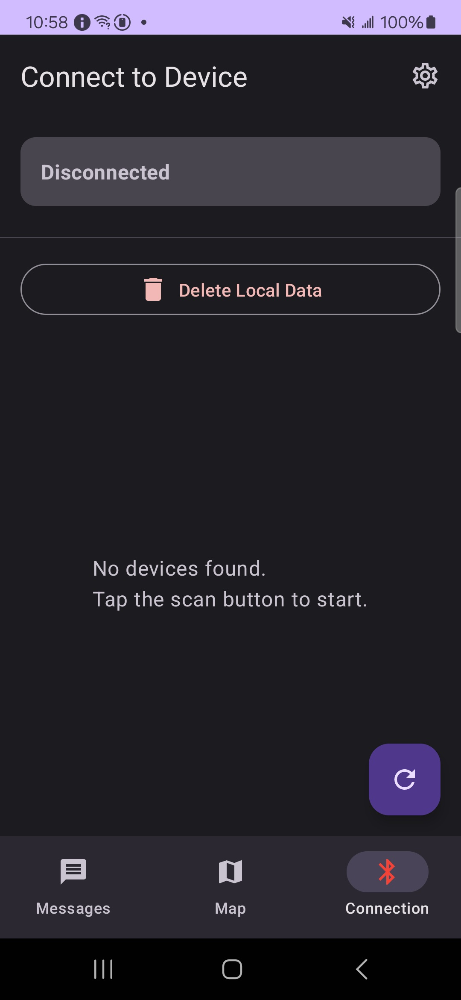
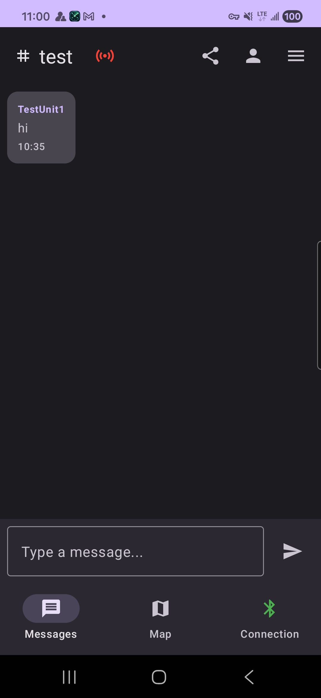
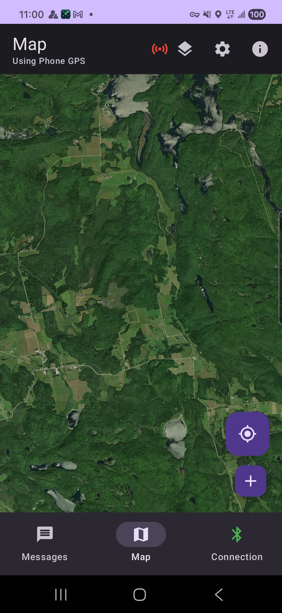
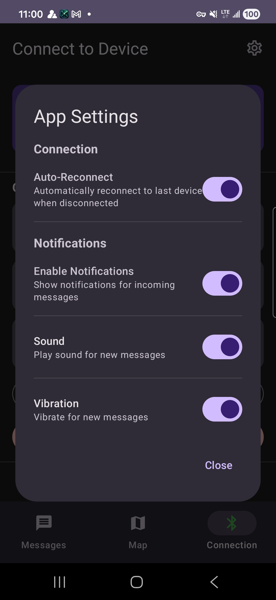

# TEAM — Tactical Emergency Area Messaging

Android application for position tracking and messaging over the MeshCore LoRa mesh network.

## Overview

TEAM is a field communications app designed for use when traditional networks are unavailable. It leverages MeshCore’s LoRa mesh network (via a companion radio) to provide:

- Real-time position sharing and mapping
- Text messaging (public channels, private channels, and direct messages)
- Offline map support with multiple providers
- Waypoint creation, sharing, and GPX import/export
- Automatic contact discovery via mesh advertisements
- Background operation (foreground service) for reliable connectivity

## Known Bugs

- Bluetooth pairing. Not prompting for pin, shows unknown device. Pair device in MeshCore App, then connect in Team. Fix in progress.

## Screenshots

| Home / Channels | Messages | Map / Telemetry | Connection | Settings |
|---|---|---|---|---|
|  |  |  |  |  |

---

## Hardware Requirements

### Companion Radio (Required)
Your Android device needs a MeshCore companion radio connected via Bluetooth:

- Heltec T114 V2 (nRF52840) — recommended for extended battery life
- LilyGO T-Beam (ESP32) — alternative option
- Other MeshCore-compatible devices running the `companion_radio` firmware

### Mobile Device
- Android 8.0+ (API 26+)
- Bluetooth LE support
- GPS capability

---

## Getting Started

### 1) Initial / Device Setup

1. Install TEAM (APK) via your team’s distribution channel (Firebase App Distribution).
2. Launch the app and complete the Permissions screen.
   - Bluetooth permissions are required to scan/connect.
   - Location permissions are required for GPS + Bluetooth scanning (Android 10+).
   - Notifications are recommended (Android 13+) for message alerts.
   - Background service is required for operation when locked or using other app.
3. Power on your companion radio and keep it nearby (10–30 feet typical BLE range).
4. Go to the Connection screen and scan for devices.
5. Tap your companion radio to connect.
6. Set a device name when prompted (this becomes your identity shown to others).

### 2) App Setup

After your first successful connection, set up a private tracking channel for your group.

#### A) Create the private tracking channel (one person)

1. Navigate to **Messages**.
2. Tap the **☰ (three bar)** menu.
3. Tap **+ New** to create a new channel.
4. Name the channel (example: `Team Tracking`) and create it.

#### B) Share the channel with your group

1. In **Messages**, select the private channel you just created.
2. Tap the **Share** icon.
3. Share via either:
   - **QR Code** (recommended in-person)
   - **Channel key / code** (copy/paste)

#### C) Join the channel (other users)

1. Navigate to **Messages**.
2. Tap the **☰ (three bar)** menu.
3. Select **Import**.
4. Either:
   - Paste/enter the channel code/key, or
   - Tap **Scan QR Code** and scan the QR from the channel creator

#### D) Enable location tracking and select the tracking channel (everyone)

1. Enable **Location Tracking**.
2. Select the newly created **private channel** as the tracking/telemetry channel.

That’s it — everyone who is connected to their companion radio and joined to the same private channel will see the locations of the other group members.

### Basic Navigation

TEAM has three main screens accessible via bottom navigation:

- Messages — chat with channels, contacts, and direct messages
- Map — view team positions, waypoints, and map tiles
- Connection — manage BLE connection and device/app settings

---

## Messages Screen (User Guide)

### Channels vs Contacts

- Channels: group chat; can be public or private.
- Contacts: direct messages to specific nodes (discovered via mesh advertisements).

### Delivery Status

Messages show delivery status icons (exact icons may vary by build), typically:

- Sending → being queued/transmitted
- Sent → delivered to the companion radio
- Delivered → confirmed by recipient(s) when supported

### Telemetry Indicator (Top Bar)

The sensors icon in the Messages top bar indicates telemetry tracking status:

- Green: telemetry is enabled and the phone is connected to the companion radio
- Red: telemetry is disabled, or it’s enabled but blocked because the phone is not connected

Tap the sensors icon to display a brief status explanation.

### Private Channels

Private channels can be shared with teammates (e.g., via a share action / QR) so everyone joins the same encrypted channel.

---

## Map Screen (User Guide)

### What You See

- Your location (phone GPS)
- Team member markers (other nodes)
- Waypoints

### Offline Maps

Download map areas for offline use from the Map settings. Once downloaded, tiles will load from cache automatically.

### Waypoints

- Create a waypoint at the current selection/crosshair and save it with a type and description.
- Share waypoints to the mesh so other teammates can receive and save them.
- Import/export waypoints via GPX.

---

## Connection Screen (User Guide)

### Scanning & Connecting

1. Tap Scan for Devices.
2. Select your companion radio.
3. Wait for the connection status to reach Connected.

### Auto-Reconnect Behavior

If the BLE link drops unexpectedly, TEAM will attempt to reconnect automatically. If you manually disconnect, TEAM should not auto-reconnect until you reconnect yourself.

### Manual Advertisement

If you need to force discovery (e.g., to announce yourself to the mesh), use the Send Advertisement control on the Connection screen.

---

## Background Operation & Battery

TEAM uses a foreground service to keep the BLE connection stable in the background.

For best results:

- Allow notifications (so the foreground service notification is permitted)
- Disable battery optimization for TEAM

---

## Troubleshooting

### Permissions problems on first launch
- If you get stuck, ensure all required permissions are granted.
- As a last resort: Android Settings → Apps → TEAM → Storage → Clear data, then relaunch.

### Can’t find the companion radio
- Confirm the radio is powered on and running `companion_radio` firmware.
- Move closer and retry.
- Toggle Bluetooth off/on.

### Telemetry icon is red
- If telemetry is disabled: enable it from Connection settings.
- If telemetry is enabled: connect to the companion radio (telemetry requires an active link).
